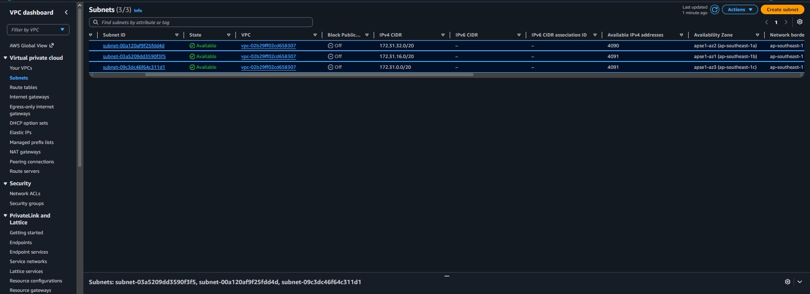
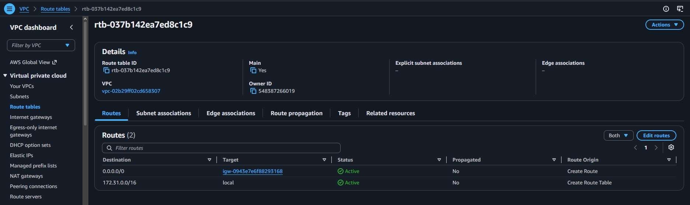
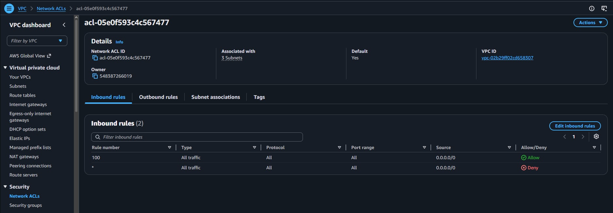
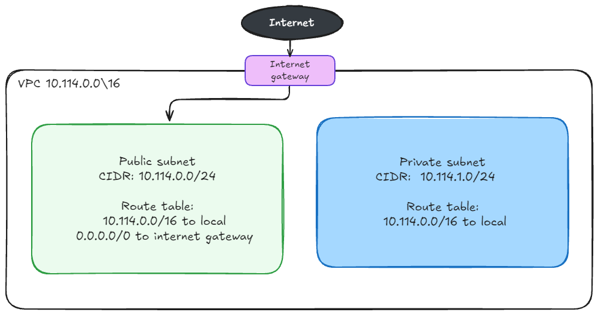

# Assignment 2 Submission

<!--
How to use this template:

1. Copy this file to submissions/assignment-2/<your-github-username>/submission.md
2. Replace every answer placeholder with your own answer. Delete the angle brackets too.
3. Save your four images in the same folder, with the exact file names below.
4. Do not write your full name or your student number in this file.
-->

## About me

- GitHub username: JoeyRVisayaJr
- Section: IV-DCSAD
- IAM user name that I signed in with: dcsad-g05
- X: 114

---

## Part A. Explore

### A1. The VPC

Default VPC IPv4 CIDR:

172.31.0.0/16

Number of addresses in that CIDR:

65,536

### A2. The subnets

| Availability Zone | IPv4 CIDR |
| --- | --- |
| `ap-southeast-1a` | `172.31.32.0/20` |
| `ap-southeast-1b` | `172.31.16.0/20` |
| `ap-southeast-1c` | `172.31.0.0/20` |

Screenshot 1. Save it as `screenshot-1-subnets.png` in your folder. The image line below shows it.

### A3. Available addresses

Available IPv4 addresses in each subnet:

ap-southeast-1a: 4,090, ap-southeast-1b: 4,091, ap-southeast-1c: 4,091.

Why is the number lower than 4,096?

Every /20 subnet starts with 4,096 total IP addresses, but AWS automatically takes 5 of those IPs for its own routing and internal services. Because of that, only 4,091 IP addresses are actually free to use.

What uses the missing address in the subnet with the lowest number?

The ap-southeast-1a subnet has 4,090 available because 1 IP address is occupied by an active network interface from an EC2 instance launched in that subnet. Even if that instance is currently stopped, its network interface still keeps the IP address.

### A4. The route table

| Destination | Target |
| --- | --- |
| `172.31.0.0/16` | `local` |
| `0.0.0.0/0` | `igw-...` |

Screenshot 2. Save it as `screenshot-2-routes.png` in your folder. The image line below shows it.

### A5. Public or private

Are the default subnets public or private? Which route proves it?

They are public subnets. I can tell that because their route table has a 0.0.0.0/0 route pointing to the internet gateway igw-... That route means any traffic going to the internet gets sent through the gateway, so the subnet can directly talk to the internet.

### A6. The internet gateway

State of the internet gateway:

Attached

What happens to the default subnets if the gateway is detached?

If the internet gateway is detached, the default subnets lose internet access. The 0.0.0.0/0 route has nowhere to send traffic, so instances can't be reached from the internet or visit outside websites. 

### A7. NAT gateways

Number of NAT gateways:

0

Can a server in a new private subnet download updates? Why?

Nope. A private subnet has no route to the internet gateway, so it relies on a NAT gateway in a public subnet to reach the outside internet for downloads. Since there are 0 NAT gateways, the server cannot connect to the internet to download updates.

### A8. The network ACL

| Rule number | Source | Allow or Deny |
| --- | --- | --- |
| 100 | `0.0.0.0/0` | Allow |
| `*` | `0.0.0.0/0` | Deny |

How is a network ACL different from a security group?

A network ACL protects the whole subnet, it's just like a wall around a group of servers. A Security Group protects one server, like a firewall around a single server. Security Groups only allow traffic and automatically allow return traffic, while Network ACLs can allow or block traffic and have separate rules for incoming and outgoing traffic.

Screenshot 3. Save it as `screenshot-3-network-acl.png` in your folder. The image line below shows it.

### A9. The default security group

Inbound rule (type and source):

It allows All traffic, with the source set to its own default security group (sg-...).

Which resources can send traffic to an instance that uses it?

Only servers or network interfaces using the same default security group can communicate with it. Since security groups only allow approved traffic, connections from the internet or other security groups are blocked by default.

---

## Part B. Prepare

### B1. Plan two subnets

- Public subnet CIDR: `10.114.0.0/24`
- Private subnet CIDR: `10.114.1.0/24`

### B2. Route tables

Route table of the public subnet:

| Destination | Target |
| --- | --- |
| `10.114.0.0/16` | `local` |
| `0.0.0.0/0` | `internet gateway` |

Route table of the private subnet:

| Destination | Target |
| --- | --- |
| `10.114.0.0/16` | `local` |

### B3. My VPC diagram

Tool used (Excalidraw, draw.io, Lucidchart, or paper):

Excalidraw

Save your diagram as `vpc-diagram.png` in your folder. The image line below shows it.

### B4. Predict a change

Can you still open the web page from your laptop? Why?

No, the web page will no longer load. Even though the instance still has a public IP, removing 0.0.0.0/0 removes its route to the internet, so it cannot send the response back to my laptop.

Can the instance still reach another instance in the VPC? Why?

Yes, internal communication still works. The 10.114.0.0/16 local route is still active, so instances within the same VPC can communicate with each other through the VPC's internal network. They do not need the Internet Gateway because the traffic stays within the VPC.

### B5. Place a database

Which subnet gets the database? Why?

The database should be placed in the private subnet (10.114.1.0/24) because it has no direct access to the internet. This helps protect the database from external attacks. The frontend web servers in the public subnet can still connect to the database using its private IP address through the VPC's local network.

### B6. My question about VPCs

What is your question, and what made you think of it?

I'm just curious, can a VPC have more than one Internet Gateway for backup, or is one igw already enough because AWS handles the redundancy? Also, since we usually use multiple AZs for high availability, I was wondering why we only need one igw for the whole VPC.